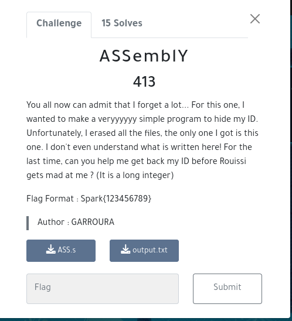
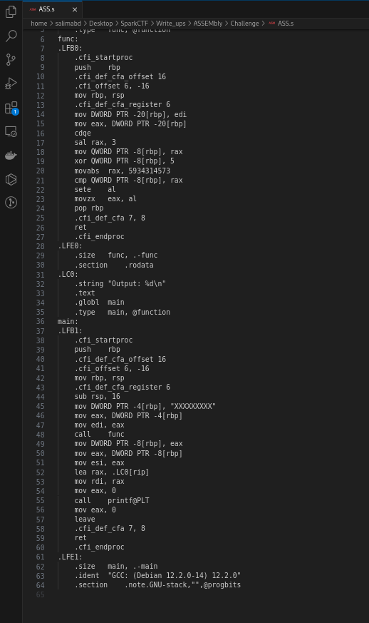

# ASSEMbly	

## Infos About challenge : 

### They are 15 Teams solved this challenge from 100 Teams
You can solve it Locally

## solution:

### Step 1 : Open The ASS.s And analyse The assembly code 

######## You notice that the assembly code has two functions main and func 

main : scan a string from user and pass it to the func function 

func function : it manipulate this string by shifting it to the left by 3 bits and after that it does the xor between the shifted value and 5

######### and At the end it compare the result value to "5934314573" and they put to output.txt 1 if the comparison is true , 0 if it's false 
 so the content of output.txt is 1 so we can say that the final output of func function after manipulating the ID is 5934314573

### Step 2 : Now it's the turn to your Scripting skills 

######## You should write script That reverse the role of func function 

So our script should bring the input that after the shifted and Xoring will be 5934314573  

so our start point is 5934314573  

we should do the xor to this value with the value 5 and after that we should shift it to the right by 3 bits because the oposite of shiftleft is shift right 

########## and this is the Script : 

###  Step 03  : Run The script And Congrats  

### flag:

######## Spark{741789321}
