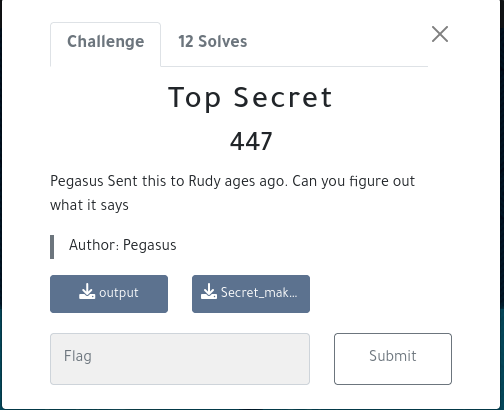
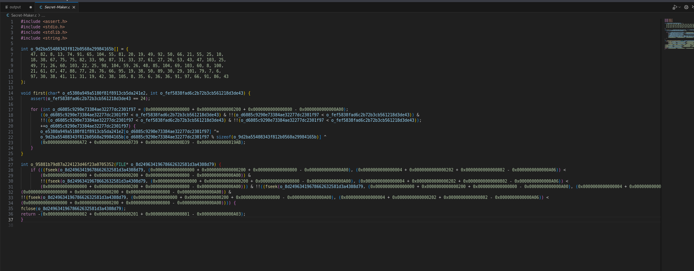
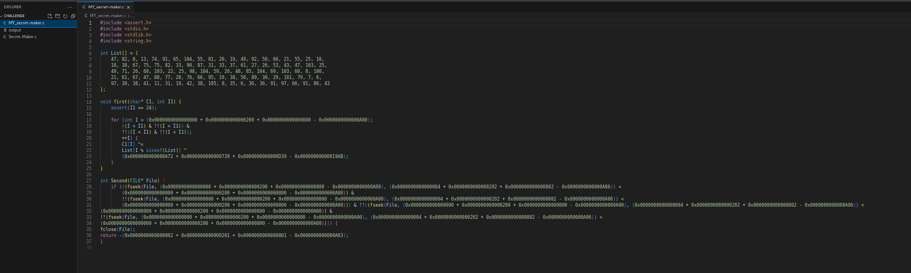
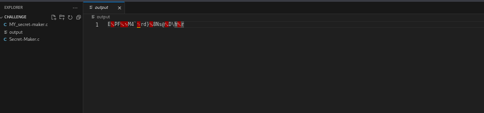
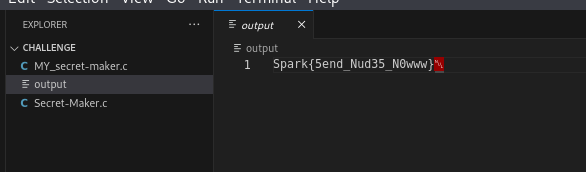

#S4L1M --> #F4K3_RooT PLAYER

## TopSecret  	

### Infos About challenge : 

### They are 12 Teams solved this challenge from 100 Teams
You can solve it Locally

## solution:

### step 1 : Open The secret-maker.c and output file

##### You notice that the file.c has a random name variable to have a clean work you should rename the variables and functions 

###### and you should notice that output is a binary file that contain encrypted data with secret-maker.c -  we should decrypt it by reversing secret-maker.c 

### Step 2 : Analyze the Secret-maker.c After rename variables

###### After analyzing : I conclude that program do this : 

    1-It reads a file specified as a command-line argument.
    2-It checks if the file exists and can be opened for reading.
    3-It calculates the size of the file.
    4-It allocates memory dynamically to store the contents of the file.
    5-It reads the content of the file into the allocated memory.
    6-It performs some XOR operations on the data read from the file with the size of the input
    7-It writes the modified data to an output file named "output".
   

so know we know that the program does a Xor between the input and some stuf addition of hex value and ... 

### Step 3 : Now time of scripting XD : 

###### our script should : 
###### 1-open the output file  
###### 2-make the same Xor operation beetween each caracter and the same stuff , because reverse of XOR operation is the same XOR operation
###### 3-write the result in our file 

###### and this is the Script : 

### Step 04  : Run The script And check the content of output file  

### flag:

#### Spark{5end_Nud35_N0www}
